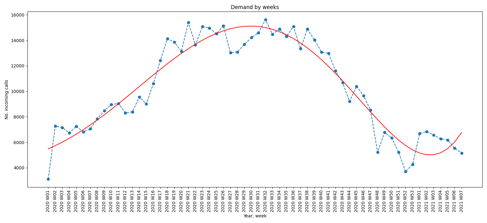
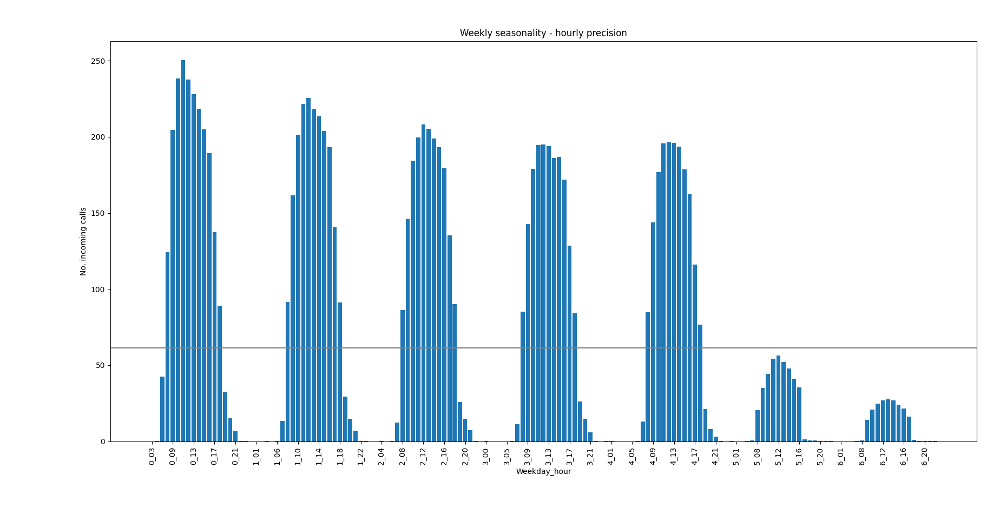
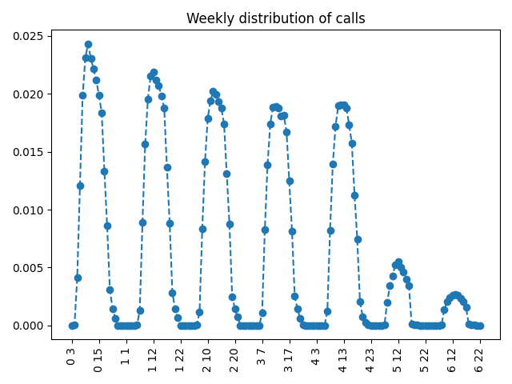
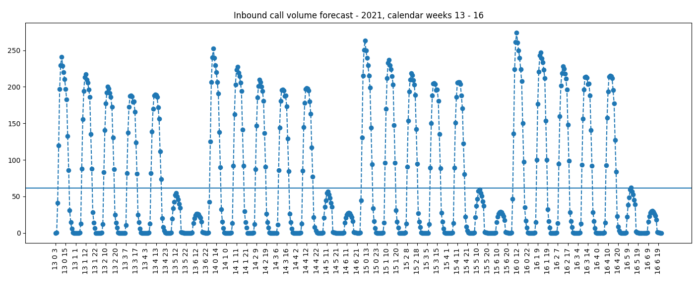
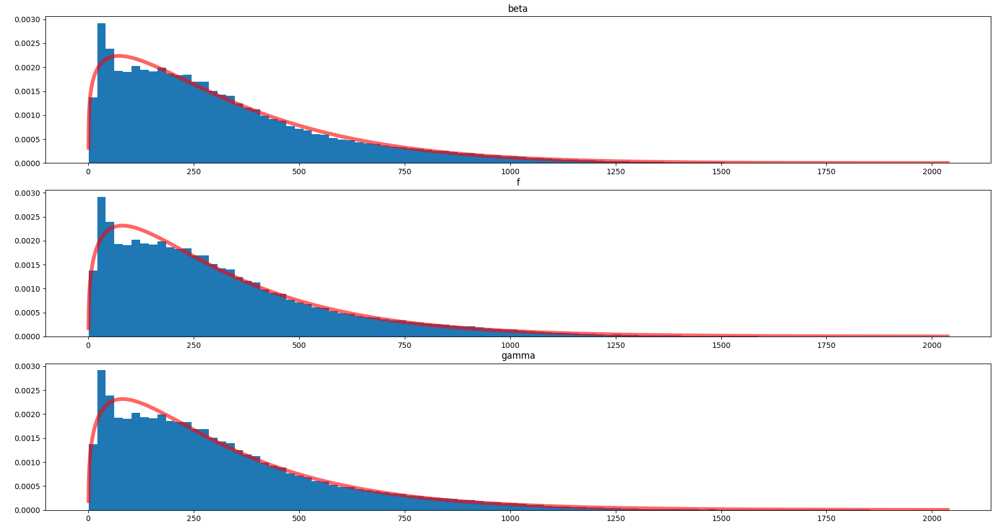

# Call Center Staffing

The staff planning is carried out in 3 phases: 

* Inbound call volume forecast

* Determine required staffing levels

* Develop shift plans

## Overview

### Inbound call volume forecast

Purpose:

* Predict the volume of inbound calls
* Provide intra-day volumes as basis for deriving the right staffing levels
* Allow for timely recruiting

Approach:

* Time series analysis
* Consider yearly, weekly, daily seasonality

Output:

* Estimated inbound call volume per hour for a  4 week period, 4 weeks out from now 

### Determine required staffing levels

Purpose:

* Find the right staffing levels depending on the inbound call volume
* Balance workforce costs and lost sales due to reneging to maximize profitability

Approach:

* Discrete event simulation
* Queuing system with impatient customers (reneging)

Output:

* Optimal number of agents for every possible customer arrival rate in steady state

### Develop shift plans

Purpose:

* Organize the shifts so as to match the optimal staffing levels
* Assign individual employees to these shifts

Approach: 

* Mixed integer programming

Output:

* Optimal number of each shift type

## Inbound call volume

### Inbound call volume seems to follow a yearly pattern

## The data shows a strong seasonal pattern within each week and day

### Inbound call volume is predicted for each individual hour

Step 1: Predict weekly call volume

* Aggregate previous year data by week
* Fit a curve to the weekly volumes
* Predict next year's weekly volumes with the curve (see yearly pattern above)

Step 2: Distribute the predicted weekly call volume (~ 10300 calls per week on average)

* Aggregate dataset to determine inner-weekly seasonality
* Distribute the predicted weekly volume proportionally

### Example: Forecast for calender weeks 13 – 16

We can observe the weekly pattern and a slight increase from week to week.

## The queue model helps to determine the right staffing levels depending on the call volume

Customer arrival process:

* Typically we assume a Poisson process
* The arrival rate is either based on historical data (baseline model) or on the forecast (using the model)

Reneging behavior:

* Difficult to characterize customer reneging behavior from the data
* I determined all other assumptions first and then played with the reneging tendency to match the historical key metrics
* Patience ~ 2 minutes on average

Service time:

* Agent time = talk time + wrap time + hold time
* Fitted 70 distributions to the data, beta distribution came out best

### Calls usually have a minimum duration

### Each individual simulation run delivers insights and allows to calculate the expected profit

* Customer arrivals over  time
* Time spent in queue histogram
* Time spent in service histogram
* Queue length over time
* Number of served customers
* Number of reneged customers
* Workforce costs = No. agent * hours * hourly cost
* Revenues = No. accepted calls * conversion rate * exp. revenue 

### The simulation model generates the „optimal“ number of simultaneously staffed workers by call volume

Baseline model: Before the simulation can be used with confidence it must be validated based on the historical observations

The optimal staffing levels are obtained by combining call vol. forecast and optimal staffing levels by call vol.

## Next steps

* Clarify data irregularities
* Verify assumptions of the simulation model 
* Make sure baseline scenario is realistic
* Optimization model to assign shifts so as to match the optimal staffing levels minimize workforce costs, subject to 
  * meeting the staffing levels 
  * allowable shift patterns and workplace restrictions
  * realistic ratio of shift patterns
  * one break a day
* Hiring plan (can probably be done manually)